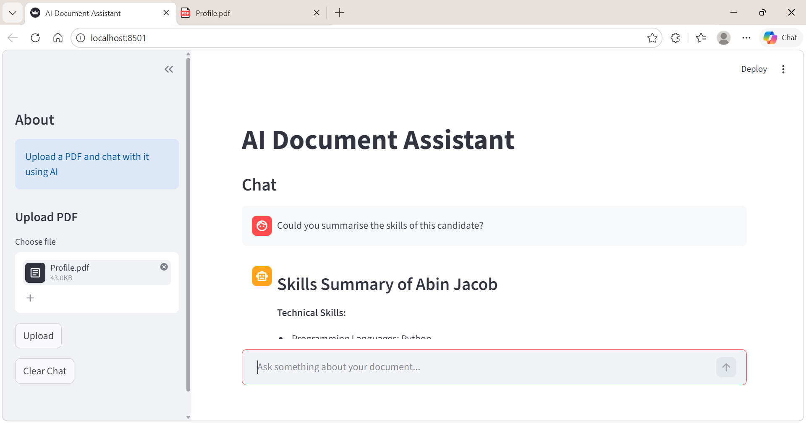

# GenAI RAG Assistant

A powerful Retrieval-Augmented Generation (RAG) assistant built with FastAPI, LangChain, and OpenAI. Upload PDF documents and ask questions to get intelligent answers based on your document content.

## Features

- 📄 **PDF Document Processing** - Upload and process PDF documents with intelligent chunking
- 🔍 **Vector Embeddings** - Uses OpenAI embeddings for semantic document understanding
- 🧠 **RAG Pipeline** - Retrieves relevant context and generates answers using GPT models
- ⚡ **FastAPI Backend** - Modern, high-performance REST API
- 📦 **FAISS Vector Store** - Efficient semantic search with local vector storage
- 🚀 **Production Ready** - Deployable on Heroku with included Procfile

## Tech Stack

- **Framework**: FastAPI, Uvicorn
- **LLM**: OpenAI API (via OpenRouter for free models)
- **Document Processing**: LangChain, PyPDF
- **Embeddings**: OpenAI Embeddings
- **Vector DB**: FAISS
- **Environment**: Python 3.x with virtual environment support

## Project Structure

```
.
├── main.py              # FastAPI application with RAG endpoints
├── app.py               # Application logic and core functions
├── rag.py               # RAG pipeline implementation
├── loader.py            # Document loading utilities
├── chunking.py          # Document chunking logic
├── embedding.py         # Embedding model setup
├── vector_store.py      # Vector store management
├── requirements.txt     # Python dependencies
├── Procfile             # Heroku deployment configuration
├── runtime.txt          # Python version specification
└── README.md            # This file
```

## Installation

### Prerequisites

- Python 3.8+
- pip package manager
- OpenAI API key (or OpenRouter key for free models)

### Setup

1. **Clone the repository**
   ```bash
   git clone <repository-url>
   cd genai-rag-assistant
   ```

2. **Create virtual environment**
   ```bash
   python -m venv venv
   source venv/bin/activate  # On Windows: venv\Scripts\activate
   ```

3. **Install dependencies**
   ```bash
   pip install -r requirements.txt
   ```

4. **Configure environment variables**
   
   Create a `.env` file in the root directory:
   ```
   OPENAI_API_KEY=your_api_key_here
   OPENAI_BASE_URL=https://api.openrouter.ai/v1  # Or your preferred endpoint
   ```

   - If using OpenRouter (free tier), get your key from [openrouter.ai](https://openrouter.ai)
   - If using OpenAI directly, use `https://api.openai.com/v1`

## Usage

### Running Locally

1. **Start the FastAPI server**
   ```bash
   python main.py
   ```
   or
   ```bash
   uvicorn main:app --reload
   ```

2. **Access the API**
   - API Docs: `http://localhost:8000/docs`
   - ReDoc: `http://localhost:8000/redoc`

3. **Test the application**
   - Use the interactive Swagger UI at `/docs`
   - Or run the example script: `python app.py`

### API Endpoints

#### Upload Document
```bash
POST /upload
Content-Type: multipart/form-data

# Upload a PDF file
file: <your-pdf-file>
```

#### Query RAG
```bash
POST /query
Content-Type: application/json

{
  "question": "What is the main topic of the document?",
  "top_k": 5
}
```

#### Health Check
```bash
GET /health
```

## Configuration

### Environment Variables

| Variable | Description | Example |
|----------|-------------|---------|
| `OPENAI_API_KEY` | API key for LLM provider | `sk-...` or openrouter key |
| `OPENAI_BASE_URL` | API endpoint URL | `https://api.openrouter.ai/v1` |

##  Architecture Diagram 

```
[User]
   ↓
[Streamlit UI]
   ↓
[FastAPI Backend]
   ↓
[Text Chunking]
   ↓
[Embeddings]
   ↓
[FAISS Vector DB]
   ↓
[Retriever]
   ↓
[LLM (OpenAI)]
   ↓
[Response]

```

### Model Selection

Change the model in `app.py` and `rag.py`:
```python
# Default model
model = "openai/gpt-3.5-turbo"  # Free via OpenRouter

# Other options
model = "gpt-4-turbo"           # More capable
model = "gpt-3.5-turbo"         # Faster, cheaper
```

## Deployment

### Live Demo

🚀 **Application deployed on Render:**  
https://genai-rag-assistant-n5mg.onrender.com/

Visit the link above to access the live API documentation and try the application!

## UI Preview

Here is a screenshot of the user interface:




### Deploy to Render

1. **Push to GitHub**
   ```bash
   git push origin main
   ```

2. **Connect to Render**
   - Go to [render.com](https://render.com) and sign up
   - Click "New +" → "Web Service"
   - Connect your GitHub repository
   - Select the repository and branch

3. **Configure Build Settings**
   - **Environment**: Python 3
   - **Build command**: `pip install -r requirements.txt`
   - **Start command**: `uvicorn main:app --host 0.0.0.0 --port $PORT`

4. **Add Environment Variables**
   - In Render dashboard, go to Environment
   - Add the following variables:
     - `OPENAI_API_KEY`: your API key
     - `OPENAI_BASE_URL`: your API endpoint

5. **Deploy**
   - Click "Create Web Service"
   - Render will automatically deploy your app
   - Your app will be available at the provided URL

### Deploy to Heroku (Alternative)

1. **Install Heroku CLI**
   ```bash
   # Download from heroku.com/download
   ```

2. **Login to Heroku**
   ```bash
   heroku login
   ```

3. **Create and deploy**
   ```bash
   heroku create your-app-name
   heroku config:set OPENAI_API_KEY=your_key_here
   heroku config:set OPENAI_BASE_URL=your_base_url
   git push heroku main
   ```

4. **View logs**
   ```bash
   heroku logs --tail
   ```

The app will be available at: `https://your-app-name.herokuapp.com`

## How It Works

1. **Document Upload** - User uploads a PDF file via the `/upload` endpoint
2. **Text Extraction** - PyPDFLoader extracts text from the PDF
3. **Chunking** - Text is split into manageable chunks using RecursiveCharacterTextSplitter
4. **Embedding** - Each chunk is converted to embeddings using OpenAI's embedding model
5. **Vector Storage** - Embeddings are stored in FAISS for fast similarity search
6. **Query Processing** - When queried, the question is embedded and similar chunks are retrieved
7. **Answer Generation** - Retrieved context is passed to GPT model to generate an answer

## Development

### Install Development Dependencies
```bash
pip install -r requirements.txt
# All dev tools are included in requirements.txt
```

### Running Tests
```bash
# Add your tests here
pytest tests/
```

### Code Organization

- **Document Processing**: `loader.py`, `chunking.py`
- **Embeddings & Vectors**: `embedding.py`, `vector_store.py`
- **RAG Logic**: `rag.py`
- **API Endpoints**: `main.py`
- **App Configuration**: `app.py`

## Troubleshooting

### Issue: "OPENAI_API_KEY not found"
- Ensure `.env` file exists in the root directory
- Verify the key is correctly set: `echo $OPENAI_API_KEY`

### Issue: FAISS installation fails
- On Windows: `pip install faiss-cpu` may require Visual C++ build tools
- Alternative: `pip install faiss-cpu==1.7.3`

### Issue: PDF processing fails
- Ensure PDF is not corrupted
- Check file permissions
- Verify PyPDF version: `pip install --upgrade pypdf`

### Issue: Slow response times
- Reduce chunk size for faster but less detailed context
- Use `top_k=3` instead of `top_k=5` for quicker retrieval

## Performance Tips

1. **Optimize chunk size** - Balance between context size and token usage
2. **Reduce embeddings** - Cache embeddings for frequently queried documents
3. **Use cheaper models** - OpenRouter Free tier models are cost-effective
4. **Index optimization** - FAISS supports multiple index types for different tradeoffs

## Security Considerations

⚠️ **Important Security Notes:**
- Never commit `.env` file with real API keys
- Add `.env` to `.gitignore` (already done)
- Validate user input before processing
- Use HTTPS in production
- Implement authentication for production APIs

## Contributing

Contributions are welcome! Please:
1. Fork the repository
2. Create a feature branch
3. Commit your changes
4. Push to the branch
5. Open a Pull Request

## License

This project is open source and available under the MIT License.

## Support

For issues, questions, or suggestions:
- Open an issue on GitHub
- Check existing documentation
- Review FastAPI docs: https://fastapi.tiangolo.com

## Contributing

Feel free to fork, modify, and use this project for your own needs!

---

**Built with ❤️ using FastAPI, LangChain, and OpenAI**
